# Cypronetics Multi-Agentic AI & LLM GRC Analyst Audit Report

---

## Executive Summary

Cypronetics Enterprises has begun implementing cybersecurity measures in line with the **NIST Cybersecurity Framework (CSF) 2.0**, but its **AI Governance, Risk Management, and Compliance (GRC)** maturity remains at **Tier 1 (Partial)**.  

This report reframes Cypronetics’s security posture through the lens of **Multi-Agentic AI**, **Large Language Models (LLMs)**, and **AI-driven Agent ecosystems**, applying industry best practices from:  

# Cypronetics Multi-Agentic AI Governance, Risk & Compliance (GRC) and LLM Audit Report – Q1 2025

---

- **NIST Cybersecurity Framework (CSF 2.0)**  
- **NIST AI Risk Management Framework (AI RMF 1.0)**
- **NIST AI RMF Playbook** 
- **MITRE ATLAS (Adversarial Threat Landscape for AI Systems)**  
- **OWASP Top 10 for LLMs**  
- **ISO/IEC 23894:2023 (AI Risk Management)**  
- **AI Regulatory Standards** (EU AI Act, U.S. AI Executive Orders)  

Key outcomes:  
- Strong IAM foundations are in place (least privilege in Terraform).  
- Major gaps in **AI governance, adversarial detection, and incident response**.  
- High-risk exposures to **prompt injection, data poisoning, and supply chain compromise**.  
- A lack of **AI-specific policies, risk registers, and governance structures**.  
- Regulatory alignment is partial; EU AI Act obligations are not yet mapped.  

**Target Objective:** Elevate Cypronetics to **Tier 4 (Adaptive)** maturity for AI security, ensuring resilience against adversarial AI threats while maintaining compliance with global regulations.  

---

## Methodology

The audit methodology follows a **multi-framework alignment** process:

1. **Framework Mapping**  
   - Mapped NIST CSF 2.0 functions (Govern, Identify, Protect, Detect, Respond, Recover) to AI/LLM security dimensions.  
   - Integrated NIST AI RMF, ISO/IEC 23894, MITRE ATLAS adversarial cases, and OWASP LLM risks.  

2. **Assessment Scope**  
   - Covers Cypronetics’s **five-agent architecture** (Planner, Reporter, Researcher, Retirement, Scheduler).  
   - Includes **model supply chain security**, **data handling**, **agent-to-agent communications**, and **cloud IAM**.  
   - Focuses on adversarial ML threats including **prompt injection**, **data poisoning**, **membership inference**, and **model evasion**.  

3. **Evaluation Criteria**  
   - Tier-based maturity assessment: Tier 1 (Partial) → Tier 4 (Adaptive).  
   - Compliance crosswalk against **EU AI Act risk categories**, **U.S. NIST AI RMF**, and **global GRC best practices**.  
   - Review of existing policies, technical controls, and organizational governance.  

---

## Executive Dashboard

| Category                | Current Maturity | Target Maturity | Gap % | Risk Level |
|--------------------------|------------------|-----------------|-------|------------|
| IAM & Access Control    | 3/5              | 4/5             | 20%   | Medium     |
| AI Model Provenance      | 1/5              | 4/5             | 60%   | High       |
| Data Governance          | 2/5              | 4/5             | 40%   | High       |
| Vulnerability Mgmt       | 3/5              | 5/5             | 40%   | Medium     |
| Regulatory Compliance    | 2/5              | 4/5             | 40%   | High       |
| Incident Response        | 1/5              | 4/5             | 60%   | Critical   |

---

## Risk Heatmap

The assessment identifies:  

- Major gaps in **AI governance, adversarial detection, and incident response**  
- High-risk exposures to **prompt injection, data poisoning, and supply chain compromise**  
- A lack of **AI-specific policies, risk registers, and governance structures**  

**Target Objective:** Elevate Cypronetics to **Tier 4 (Adaptive)** maturity for AI security, ensuring resilience against adversarial AI threats while maintaining compliance with global regulations.  

---

## Audit Findings by CSF Function

---

### 1. Govern – AI Governance & Accountability

**Findings:**  
- Cypronetics lacks a **formal AI governance structure** to oversee risks across its agentic AI systems.  
- No **AI accountability framework** defining roles, responsibilities, or ethical oversight.  
- Missing **AI-specific policies** (acceptable use, agent interaction protocols, AI fairness guidelines).  
- No established **AI Risk Register** documenting adversarial risks like data poisoning or prompt injection.  
- No integration of **compliance readiness** for **EU AI Act** or **ISO/IEC 23894** requirements.  

**Impact:**  
Without governance, AI systems operate without accountability, exposing Cypronetics to **legal, ethical, and operational risks**.  

**Pass/Fail:** ❌ Fail  

**Recommendations:**  
1. Establish an **AI Governance Committee** reporting to the Board.  
2. Create an **AI Risk Register** aligned with NIST AI RMF.  
3. Define **AI model accountability policies** (bias monitoring, explainability, fairness).  
4. Integrate **regulatory scanning** for compliance with EU AI Act and U.S. Executive Orders.  
5. Implement **AI ethical review boards** for high-risk use cases.

---

### 2. Identify – AI Assets, Risks & Supply Chain

**Findings:**  
- No centralized **AI asset inventory** covering agents, APIs, datasets, or embeddings.  
- Limited awareness of **third-party model dependencies** (LLM APIs, pretrained models).  
- No **model provenance tracking** to verify lineage of training data and updates.  
- No **SBOM for AI models**, increasing supply chain exposure.  
- Lack of **data risk classification** for training and inference datasets.  

**Impact:**  
Unidentified AI assets and supply chain blind spots create **shadow AI risks** and **compliance blind spots**.  

**Pass/Fail:** ❌ Fail  

**Recommendations:**  
1. Build a **complete AI Asset Inventory** (agents, datasets, APIs, models).  
2. Enforce **AI SBOM requirements** (Model Bills of Materials).  
3. Track **model provenance** using cryptographic signatures.  
4. Classify **datasets by risk sensitivity**.  
5. Integrate **vendor risk assessments** for external AI/LLM providers.

---

### 3. Protect – AI Identity, Data, and Model Security

**Findings:**  
- IAM uses **least privilege**, but agent-to-agent access is overly permissive.  
- No restrictions on **cross-agent data sharing**.  
- Missing controls for **prompt injection**, **model inversion**, or **embedding exfiltration**.  
- No **data isolation** between training and inference pipelines.  
- No **AI cryptographic integrity checks** for models and datasets.  

**Impact:**  
Adversaries could **inject malicious prompts**, **steal embeddings**, or **compromise agents**.  

**Pass/Fail:** ⚠️ Partial  

**Recommendations:**  
1. Apply **zero-trust IAM** to all AI agents.  
2. Deploy **prompt injection filters / LLM firewalls**.  
3. Isolate **training vs inference environments**.  
4. Protect embeddings with **encryption at rest & in transit**.  
5. Sign models with **cryptographic attestation**.

---

### 4. Detect – AI Threat Monitoring & Adversarial Detection

**Findings:**  
- Monitoring is limited to infrastructure logs.  
- No **AI adversarial telemetry** (prompt anomaly detection, data poisoning indicators).  
- No **model drift monitoring** or **bias emergence tracking**.  
- No integration of **MITRE ATLAS red-team scenarios**.  
- Lack of **real-time monitoring dashboards** for AI behaviors.  

**Impact:**  
Attacks on LLMs or agents could go **undetected**, leading to **silent compromise**.  

**Pass/Fail:** ❌ Fail  

**Recommendations:**  
1. Deploy **AI-native monitoring tools** for adversarial detection.  
2. Implement **continuous telemetry** for prompt injection and data poisoning attempts.  
3. Use **model drift detection systems** to track AI behavior changes.  
4. Red-team AI agents with **MITRE ATLAS adversarial techniques**.  
5. Establish **real-time monitoring dashboards** with anomaly alerts.  

---

### 5. Respond – AI Incident Response & Containment

**Findings:**  
- Incident response playbooks exist but are **generic IT-focused**.  
- No **AI-specific playbooks** for adversarial ML events.  
- No **rollback strategies** for compromised models.  
- No defined **regulatory notification processes** for AI-related incidents.  
- No **forensic logging** for AI agent communications.  

**Impact:**  
Cypronetics cannot effectively respond to **AI incidents**, exposing it to **regulatory penalties** and **operational disruption**.  

**Pass/Fail:** ❌ Fail  

**Recommendations:**  
1. Create **AI-specific IR playbooks** (prompt injection, data poisoning, agent compromise).  
2. Develop **rollback & quarantine procedures** for poisoned models.  
3. Establish **AI forensic logging** for agent interactions.  
4. Define **AI breach disclosure protocols** for regulators.  
5. Integrate IR with **AI governance board escalation paths**.  

---

### 6. Recover – AI Recovery & Resilience

**Findings:**  
- Recovery strategies focus on infrastructure, not AI-specific resilience.  
- No **fallback AI models** or **hot-swappable agents**.  
- No **resilience testing** (chaos engineering for AI, adversarial stress testing).  
- No **post-incident AI risk reassessment**.  
- No **continuous improvement cycle** for AI security posture.  

**Impact:**  
AI incidents could result in **long-term outages**, **loss of trust**, and **data integrity issues**.  

**Pass/Fail:** ❌ Fail  

**Recommendations:**  
1. Create **AI model fallback strategies** with safe defaults.  
2. Conduct **chaos engineering tests** on AI systems.  
3. Run **adversarial red-teaming simulations** quarterly.  
4. Implement **post-incident AI risk reviews**.  
5. Establish **continuous resilience improvement cycles**.

---

## Maturity Assessment

| CSF Function | Current Tier | Target Tier |
|--------------|--------------|--------------|
| Govern       | 1 - Partial  | 4 - Adaptive |
| Identify     | 1 - Partial  | 4 - Adaptive |
| Protect      | 2 - Risk-Informed | 4 - Adaptive |
| Detect       | 1 - Partial  | 4 - Adaptive |
| Respond      | 1 - Partial  | 4 - Adaptive |
| Recover      | 1 - Partial  | 4 - Adaptive |

**Current Maturity:** Tier 1 – Partial  
**Target Maturity:** Tier 4 – Adaptive  

---

## Compliance Matrix

| Standard/Framework | Coverage | Notes                              |
| ------------------ | -------- | ---------------------------------- |
| NIST CSF 2.0       | Partial  | Requires AI-specific mapping       |
| NIST AI RMF 1.0    | Partial  | Risk register not complete         |
| ISO/IEC 23894      | Partial  | Missing model provenance tracking  |
| MITRE ATLAS        | Minimal  | Red-team exercises absent          |
| OWASP LLM Top 10   | Minimal  | Prompt injection detection missing |
| EU AI Act          | Minimal  | Compliance readiness not verified  |

---

## Roadmap to AI GRC Maturity

### Phase 1 – Foundation
- Establish AI Governance Committee.  
- Create AI Risk Register.  
- Build AI Asset Inventory.  
- Draft AI data handling and security policies.  

### Phase 2 – Integration
- Deploy AI-native adversarial monitoring.  
- Integrate MITRE ATLAS scenarios into red-teaming.  
- Create AI-specific incident response playbooks.  
- Implement cryptographic model attestation.  

### Phase 3 – Optimization
- Conduct chaos engineering for AI.  
- Automate risk assessments across agents.  
- Establish continuous compliance with AI regulations.  
- Create regulatory AI reporting pipelines.  

### Phase 4 – Adaptive
- Real-time governance dashboards.  
- Adaptive self-correcting AI controls.  
- Continuous red-teaming and AI assurance audits.  
- Full compliance with EU AI Act, ISO/IEC 23894, and NIST AI RMF.  

---

## Appendices

### Appendix A – Framework Mapping
- **NIST CSF 2.0** → Core AI Functions.  
- **NIST AI RMF** → Risk Profiles and Governance.  
- **MITRE ATLAS** → Threat scenarios.  
- **OWASP LLM Top 10** → Agent & API risks.  
- **ISO/IEC 23894** → AI risk management controls.  

### Appendix B – AI Threat Landscape
- **Prompt Injection**  
- **Data Poisoning**  
- **Membership Inference**  
- **Model Evasion**  
- **Embedding Exfiltration**  
- **Supply Chain Compromise**  

### Appendix C – Compliance Alignment
- **EU AI Act** – Risk classification.  
- **U.S. AI Executive Orders** – Trustworthy AI.  
- **GDPR** – AI-related data protection.  
- **ISO/IEC 23894** – AI risk management.  

### Appendix D – Glossary
- **Agentic AI** – Autonomous systems of interacting AI agents.  
- **Model Provenance** – Traceability of AI model origins.  
- **Adversarial ML** – Techniques designed to fool AI models.  
- **SBOM for AI** – Software Bill of Materials adapted for models.  

---

## Conclusion

Cypronetics remains in the **early stages of AI GRC maturity**, with **critical gaps** across governance, detection, and recovery. By following this roadmap and implementing the recommended controls, Cypronetics can evolve into a **Tier 4 Adaptive AI Security Organization**, capable of:  

- Managing adversarial threats in real time.  
- Maintaining compliance with global AI governance laws.  
- Ensuring resilience and trustworthiness in its Multi-Agent AI systems.  

**Final Assessment:** Cypronetics must prioritize **AI GRC governance, adversarial detection, and compliance readiness** to secure its future in the rapidly evolving AI landscape.  

### Evidence – IAM Review
- IAM roles reviewed in terraform/6_agents/main.tf
- Minimal privilege confirmed (✔️)
- AI-specific scoping missing (❌)

### Evidence – Model Training
- Logs from Jan–Mar 2025 reviewed
- No dataset provenance metadata (❌)
- No bias testing (❌)

### Evidence – Vulnerability Management
- Tenable scans (Dec 2024) reviewed
- Critical CVEs found in container images (❌)
- Patch compliance: 70% (below SLA)
  
---

### AI GRC Risk Heatmap with Severity Levels

```mermaid
graph LR
    High[🔥 High Risk] -->|Critical| PromptInjection[Prompt Injection]
    High -->|Critical| DataPoisoning[Data Poisoning]
    Medium[⚠️ Medium Risk] -->|Elevated| ModelEvasion[Model Evasion]
    Medium -->|Elevated| EmbeddingExfiltration[Embedding Exfiltration]
    Low[✅ Low Risk] -->|Monitored| Drift[Model Drift]
    Low -->|Monitored| VendorRisk[Vendor Model Risk]
```

---

### Appendix B – Risk Map

---

### Agent-to-Agent Data Flow (Attack Surface Map)

---

### AI Incident Response Workflow

```mermaid

flowchart TD
    Detect[🚨 Detect AI Incident] --> Classify[Classify Incident Type]
    Classify -->|Prompt Injection| Contain1[Contain & Rollback]
    Classify -->|Data Poisoning| Contain2[Quarantine Model]
    Classify -->|Agent Compromise| Contain3[Revoke IAM Keys]
    Contain1 --> Report[Report to AI Governance Board]
    Contain2 --> Report
    Contain3 --> Report
    Report --> Recover[Model Recovery & Risk Reassessment]
    Recover --> Improve[Continuous Improvement Cycle]

```

---

### AI Model Lifecycle Security (Pipeline Diagram)

```mermaid

flowchart LR
    Data[📂 Data Collection] --> Train[🧠 Model Training]
    Train --> Validate[🔍 Validation & Testing]
    Validate --> Deploy[🚀 Deployment]
    Deploy --> Monitor[📡 Monitoring & Logging]
    Monitor --> Update[♻️ Model Updates]
    Update --> Train

    %% Security Gates
    Data -.->|Data Integrity Checks| Train
    Train -.->|Adversarial Testing| Validate
    Validate -.->|Red Team Review| Deploy
    Deploy -.->|Telemetry & Drift Detection| Monitor
    Monitor -.->|Compliance Reporting| Update


```

---

### 📊 Risk Matrix (Impact vs Likelihood)

```mermaid
quadrantChart
    title "AI Security Risk Matrix"
    x-axis "Likelihood →"
    y-axis "Impact ↑"
    quadrant-1 "High Impact / Low Likelihood"
    quadrant-2 "High Impact / High Likelihood"
    quadrant-3 "Low Impact / Low Likelihood"
    quadrant-4 "Low Impact / High Likelihood"
    "Prompt Injection" : [0.8, 0.6]
    "Model Bias" : [0.4, 0.7]
    "Data Exfiltration" : [0.9, 0.9]
    "Supply Chain Poisoning" : [0.6, 0.8]
```

---

### 🔄 Threat Lifecycle (AI-Specific Kill Chain)

---

### 🛡️ Defense-in-Depth Model (Layered Security)

---

### 🚨 Incident Response Workflow (AI Playbook)

---

### 📡 Attack Surface Map

---

### 📈 Roadmap for AI Security Maturity

